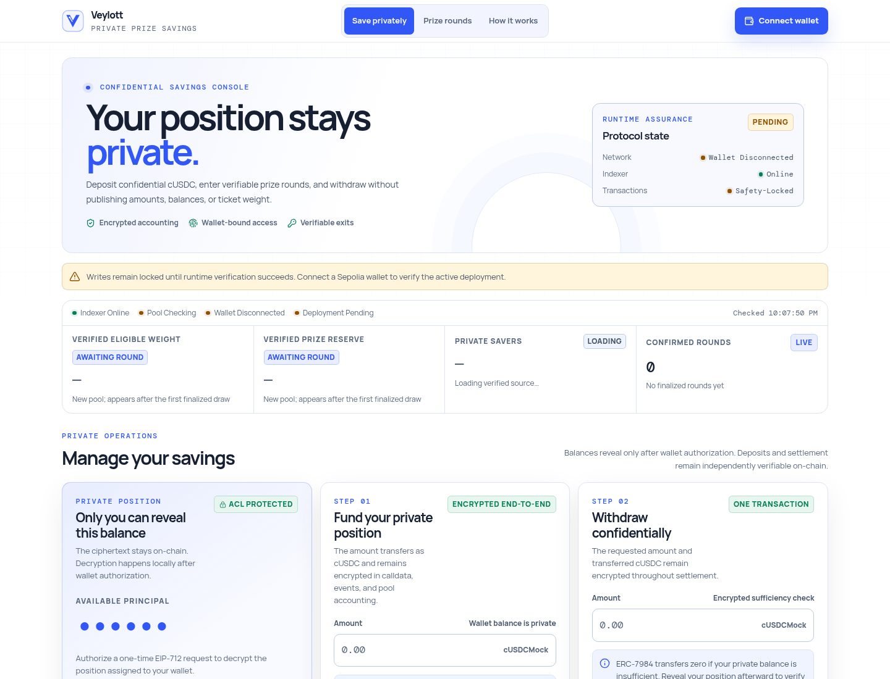

# Veylott

<p align="center"></p>

Veylott is a confidential prize-savings prototype for Zama fhEVM. It uses the official ERC-7984 `cUSDCMock` wrapper on Ethereum Sepolia so deposit amounts, saved positions, withdrawals, prize reserves, and winner credits remain encrypted on-chain.

> Veylott is research software using test assets. It has not been independently audited and must not hold real funds.

## Why Veylott

Public prize pools reveal each saver’s position and therefore their exact winning odds. Veylott instead performs balance updates, sufficiency checks, and weighted winner selection over `euint64` ciphertexts. A wallet may reveal its own position with an EIP-712 authorization, but the application does not index plaintext user balances.



The interface reports public protocol health without substituting sample balances when a wallet, deployment check, or verified source is unavailable.

## Architecture

```text
Wallet + Zama Relayer SDK
  │ encrypted amount + input proof
  ▼
Official cUSDCMock (ERC-7984)
  │ actual encrypted transfer amount
  ▼
ConfidentialPool
  ├─ encrypted user positions and prize counters
  ├─ encrypted aggregate liability, eligible draw weight, and prize reserve
  ├─ KMS-verified positive-position participant activation
  ├─ direct confidential withdrawals
  └─ two-step, KMS-verified weighted draws
          │
          ▼
Backend indexer (event counts + verified aggregate snapshots only)

Sponsor wallet
  └─ encrypted cUSDC testnet contribution ──► prize reserve
```

Deposits use `confidentialTransferAndCall`. The pool credits the encrypted amount returned by the token, preventing a caller from claiming more than was transferred. A new address enters the draw set only after the KMS proves its encrypted position is positive; the amount stays private, stale proofs cannot be replayed, and encrypted-zero callbacks never consume participant capacity. Withdrawals accept an encrypted amount and debit accounting by the token’s actual encrypted transfer result. Draws temporarily lock balance-changing operations, publicly decrypt only the eligible aggregate weight and reserve, verify both storage-bound handles with `FHE.checkSignatures`, then select a winner over encrypted cumulative balances with `FHE.randEuint64`. After a round, each saver can privately reveal only their own prize counter. A positive prize is claimed through the same encrypted withdrawal path as principal, so calldata and events do not distinguish a prize claim from an ordinary private withdrawal.

The Sepolia prize reserve is explicitly sponsor-funded. The official Zama cUSDCMock wraps `0x9b5C...DFfF`, whereas Aave Sepolia’s deployed USDC market uses `0x94a9...E4C8`; treating either a passive token holder or an unrelated Aave position as pool yield would be false. The rejected strategy and production path are documented in [the reserve funding model](docs/operations/reserve-funding.md).

## Live Sepolia Deployment

| Component | Address |
| --- | --- |
| ConfidentialPool | [`0x54FdC46D0EA722EfA4853192678b35fCABFad99C`](https://sepolia.etherscan.io/address/0x54FdC46D0EA722EfA4853192678b35fCABFad99C) |
| Official cUSDCMock | [`0x7c5BF43B851c1dff1a4feE8dB225b87f2C223639`](https://sepolia.etherscan.io/address/0x7c5BF43B851c1dff1a4feE8dB225b87f2C223639) |
| Test USDCMock underlying | [`0x9b5Cd13b8eFbB58Dc25A05CF411D8056058aDFfF`](https://sepolia.etherscan.io/address/0x9b5Cd13b8eFbB58Dc25A05CF411D8056058aDFfF) |
| Legacy exit-only pool | [`0x602AE8011F478EBbe87Da760C054B5C25911612a`](https://sepolia.etherscan.io/address/0x602AE8011F478EBbe87Da760C054B5C25911612a) |

- Application: [veylott.vercel.app](https://veylott.vercel.app)
- Indexer: [cipherpool-backend.onrender.com](https://cipherpool-backend.onrender.com)
- Deployment verification and historical encrypted prize-lifecycle evidence: [Sepolia operations guide](docs/operations/sepolia-deployment.md)
- Official Zama wrapper registry: [Sepolia confidential-token addresses](https://github.com/zama-ai/protocol-apps/blob/main/docs/addresses/testnet/sepolia.md)

## Demo and First Use

- [Captioned demo video](docs/showcase/presentation/Veylott-Demo.mp4)
- [Presentation PDF](docs/showcase/presentation/Veylott-Presentation.pdf)
- [Editable PowerPoint deck](docs/showcase/presentation/Veylott-Presentation.pptx)

To explore safely, open the application, connect the intended wallet on Ethereum Sepolia, and wait for runtime assurance to verify the chain, bytecode, and custody asset. Obtain test USDC, wrap it with the official cUSDC contract, then use Veylott's encrypted deposit, prize-round, private prize claim, and direct-withdrawal actions. Review every wallet prompt before signing and treat only a confirmed receipt as success. The recorded transactions above are historical evidence, not a promise that a new transaction has completed.

## Repository Layout

- `contracts/` — pool, interfaces, and archived legacy components.
- `test/` — Foundry unit, adversarial, and integration tests.
- `frontend/` — React/Vite application.
- `client/` — Zama input-encryption adapter shared by the frontend.
- `backend/` — TypeScript event indexer and read-only API.
- `script/` — reviewed Sepolia deployment script.
- `docs/` — security analysis, operations, UX, and submission material.

## Local Development

Requirements: Node.js 22+, Foundry, and PostgreSQL.

```bash
npm ci
cp .env.example .env
cp frontend/.env.example frontend/.env
npm test
npm run build:backend
npm run build:frontend
```

To make a real encrypted testnet prize contribution, load credentials from an external keystore and run `npm run fund:sponsor-reserve`. Required variables and receipt checks are documented in [the reserve funding guide](docs/operations/reserve-funding.md).

For a fail-closed deposit, draw, private claim, and withdrawal demonstration, use the phase-by-phase [live Sepolia lifecycle guide](docs/operations/live-prize-lifecycle.md). The runner defaults to read-only preflight and requires an exact state-bound confirmation phrase for every write.

Set `RPC_URL` and `DATABASE_URL` in `.env`. Frontend writes remain disabled unless `VITE_ENABLE_PROTOCOL_WRITES=true` and runtime verification confirms the configured chain, pool bytecode hash, cUSDC address, symbol, and decimals.

Run the backend with `npm run build:backend && node dist/backend/src/index.js`. Run the frontend locally with `npx vite --config vite.config.ts`.

## Security Properties

- No active deposit or withdrawal function accepts a plaintext amount.
- The token callback is accepted only from the configured cUSDC contract.
- Invalid callback actions are rejected by returning an encrypted `false`, allowing ERC-7984 to refund.
- Draw proofs are bound to both encrypted aggregate handles stored by the pool.
- An address enters the draw set only after a storage-bound KMS proof verifies its encrypted position is positive.
- Any keeper can relay a valid proof for an active draw; the caller cannot change its committed handles or prize amount.
- Draw requests use an immutable prize and minimum cadence; any wallet may request the next eligible round without owner-set timing or prize size.
- A stale draw can be cancelled permissionlessly after 24 hours.
- Protocol writes fail closed when deployment evidence does not match configuration.
- Secrets, private keys, RPC credentials, and deployment tokens must never be committed.

## Current Limitations

- Sepolia prizes are funded by voluntary encrypted sponsor contributions, not generated yield. A production deployment should adopt Zama’s audited confidential batching pattern for an ERC-4626 strategy whose underlying asset matches the pool’s cUSDC wrapper.
- Winner selection is linear in participant count and is intended for a bounded prototype pool.
- KMS-verified participant activation is live. Activated addresses remain in the linear participant set after later full withdrawals; scalable membership lifecycle is tracked separately.
- Aggregate weight and reserve become public when a draw is requested; individual positions and the winner remain encrypted.
- The active Sepolia pool enforces permissionless, fixed-prize, cadence-controlled draw requests; see [the draw policy](docs/operations/draw-policy.md).

## License

BSD-3-Clause-Clear. See [LICENSE](LICENSE).
