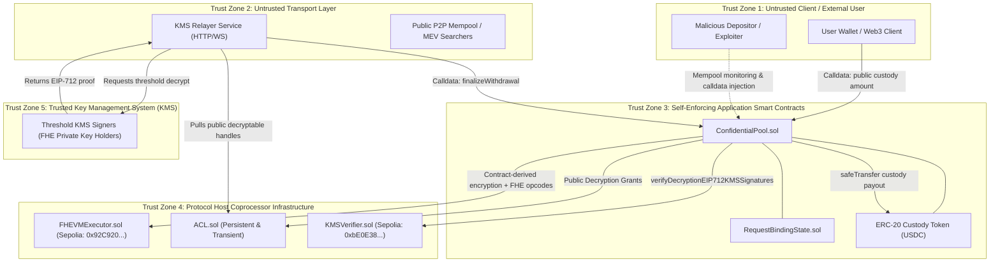

# Threat Model & Security Architecture: Confidential PoolTogether

> **Archived design:** This document describes the superseded plaintext-custody pool and is retained only as historical analysis. It is not evidence for the active ERC-7984 deployment; see [`docs/ux/user-flows.md`](../ux/user-flows.md) and [`docs/operations/sepolia-deployment.md`](../operations/sepolia-deployment.md).

**Issue Reference:** [#9 — docs(threat-model): Formalize threat model with DAG handle provenance and KMS trust boundaries](https://github.com/Webghost01-NG/cipherpool/issues/9)
**Milestone:** Phase 2 — Project Architecture & Threat Modeling  
**Author:** Security Research Team  
**Version:** 1.0 (Forensically Verified)  
**Status:** Complete & Ready for Review  

---

## 1. Executive Summary & Security Posture

Confidential PoolTogether operates as a prize savings protocol on Ethereum Sepolia utilizing Zama's Fully Homomorphic Encryption Virtual Machine (`@fhevm/solidity@0.13.3` and `@fhevm/host-contracts@0.9.0`). The protocol preserves the core "no-loss" economic property while introducing **homomorphic balance confidentiality** and **encrypted lottery draws**.

This document formalizes the protocol's threat model, maps its physical and cryptographic trust boundaries, categorizes adversary capabilities, and demonstrates how application-level invariants close the protocol-level gaps identified during the Phase 1 forensic investigation.

---

## 2. System Trust Boundaries & Architecture Map

The system is partitioned into 5 distinct trust zones separated by cryptographic verification and contract authorization boundaries:

### 2.1 Boundary Classifications

| Trust Zone | Component | Trust Assumption | Failure Impact |
| :--- | :--- | :--- | :--- |
| **Zone 1: Client** | User Wallet | **UNTRUSTED:** Calldata, signatures, and timing may be adversarial. | Isolated to caller's own funds. |
| **Zone 2: Transport** | KMS Relayer | **UNTRUSTED:** Can drop, reorder, delay, or inspect public traffic. | Liveness delay only; cannot forge proofs or steal funds. |
| **Zone 3: Application** | `ConfidentialPool.sol` | **SELF-ENFORCING:** Executes on EVM consensus with strict CEI state invariants. | Core protocol solvency and accounting integrity. |
| **Zone 4: Host Host** | Zama Coprocessor | **SEMI-TRUSTED:** Deployed Zama infrastructure on Sepolia. DAG computation correctness assumed. | Correct homomorphic execution; domain separation. |
| **Zone 5: KMS** | Threshold Signers | **TRUSTED ($t$-of-$n$):** Holds master FHE decryption secret key. | Confidentiality of encrypted balances; decryption validity. |

---

## 3. Threat Actor Categorization & Capabilities Matrix

| Adversary Class | Resources & Access | Objective | Protocol Defense Mechanism |
| :--- | :--- | :--- | :--- |
| **A1: Malicious Depositor** | Can submit arbitrary calldata and transactions. | Inflate an encrypted balance beyond deposited custody or overdraft the pool. | - One `uint64 amount` drives both custody transfer and `FHE.asEuint64` credit. - `FHE.select` balance sufficiency gating. - Storage-anchored handle verification. |
| **A2: MEV Searcher / Front-Runner** | Can monitor public mempool, reorder, or front-run transactions. | Front-run withdrawal finalization or steal in-flight payouts. | - `pendingWithdrawals[msg.sender]` restricts finalization to caller. - `CANCELLATION_DELAY = 1 days` prevents cancellation front-running. |
| **A3: Byzantine Relayer** | Controls off-chain KMS proof transport; can censor or delay proofs. | Extort users, censor withdrawals, or forge decrypted amounts. | - Calldata tampering invalidates EIP-712 KMS digest. - User can cancel stale requests after `CANCELLATION_DELAY`. - Anyone (user or relayer) can submit valid proofs. |
| **A4: Malicious Peer Contract** | Deployed on same chain; shares the same `KMSVerifier` and coprocessor. | Substitute handles across contracts to claim unauthorized funds. | - Deposit credits are created internally, not accepted as caller-supplied handles. - Finalization reads handles strictly from internal storage. - FHE ACLs restrict handle use. |
| **A5: Colluding Validator** | Controls block building and transaction inclusion. | Force concurrent finalization and cancellation in same block. | - EVM transaction serialization guarantees strict mutual exclusion ($\text{Finalized} \cap \text{Cancelled} = \emptyset$). |

---

## 4. Comprehensive Attack Surface & Mitigation Taxonomy

### 4.1 Handle Provenance & Cross-Contract Re-Use
- **Threat Vector:** Can an attacker submit or substitute a ciphertext handle created outside the pool to obtain an unbacked balance or withdrawal?
- **Root Mitigation:**
  1. **Contract-Derived Deposits:** `deposit(uint64 amount)` creates the encrypted credit with `FHE.asEuint64(amount)`; calldata has no ciphertext-handle field.
  2. **Single Amount Source:** The same `amount` is used for the encrypted credit, plaintext accounting, and custody transfer.
  3. **Storage Anchoring:** `finalizeWithdrawal` constructs `handles[0]` exclusively from `pendingWithdrawals[msg.sender].handle` in storage. Calldata cannot supply or alter the handle.

---

### 4.2 Replay & Double-Spending Attacks
- **Threat Vector:** An attacker resubmits a valid `(cleartext, decryptionProof)` pair multiple times to withdraw funds repeatedly.
- **Root Mitigation:**
  - In `finalizeWithdrawal`, the contract executes `delete pendingWithdrawals[msg.sender]` **strictly before** any external token transfer (`Checks-Effects-Interactions`).
  - Upon storage zeroing, `req.active` becomes `false`.
  - Any subsequent finalization attempt reverts immediately with `NoActiveWithdrawalRequest(msg.sender)`.
  - Nonces in `userWithdrawalNonces[msg.sender]` increment monotonically, guaranteeing distinct `requestHash` preimages.

---

### 4.3 Stale Handle Dynamics & Cancellation Races
- **Threat Vector:** An attacker initiates a withdrawal, observes proof generation, and races `cancelWithdrawal` against `finalizeWithdrawal`.
- **Root Mitigation:**
  - `cancelWithdrawal()` requires `block.timestamp > req.timestamp + CANCELLATION_DELAY`.
  - `CANCELLATION_DELAY` is enforced at `1 days` ($86,400$ seconds), while normal KMS decryption latency is $\approx 5\text{–}30$ seconds.
  - Transactions are serialized by the EVM. If `finalizeWithdrawal` mines first, storage is cleared and cancellation reverts. If `cancelWithdrawal` mines first, storage is cleared and finalization reverts. Double payout is physically impossible.

---

### 4.4 Range Reduction in Confidential Draws
- **Threat Vector:** Zama's bounded random primitive accepts only power-of-two bounds, while valid pool totals are arbitrary positive `uint64` values.
- **Root Mitigation:**
  - Draws start with a full-width encrypted `uint64` random value $R$ and compute $\lfloor R N / 2^{64} \rfloor$ for the public verified total $N$.
  - The multiplication uses an encrypted `uint128` intermediate, so the product of two `uint64` values cannot overflow and the result is always in $[0,N)$.
  - Each ticket has either $\lfloor 2^{64}/N \rfloor$ or $\lceil 2^{64}/N \rceil$ preimages. The absolute difference between bucket probabilities is therefore at most $2^{-64}$.
  - This avoids the production `NotPowerOfTwo()` failure and the much larger low-ticket bias introduced by direct modulo reduction. The residual finite-domain deviation is documented rather than described as perfect uniformity.

---

### 4.5 Honest Privacy & Observable Leakage Model
The protocol maintains strict cryptographic boundaries regarding what is private versus what is publicly observable:

| Data Element | Visibility | Cryptographic State |
| :--- | :---: | :--- |
| **Individual User Balances (`_balances[user]`)** | **CONFIDENTIAL** | Encrypted `euint64`. Stored as opaque `bytes32` handles. |
| **Accumulated Prize Winnings (`_prizes[user]`)** | **CONFIDENTIAL** | Encrypted `euint64`. Stored as opaque `bytes32` handles. |
| **Aggregate Reserved Prizes (`_reservedPrizesPlain`)** | **PUBLIC** | Plaintext custody liability; does not identify winners. |
| **Lottery Random Seed (`randVal`)** | **CONFIDENTIAL** | Generated homomorphically via `FHE.randEuint64()`. Never decrypted. |
| **Winner Identification during Draw** | **CONFIDENTIAL** | Homomorphic cumulative sum + `FHE.select`. Zero plaintext branching. |
| **Total Accounted Balance (`totalAccountedBalancePlain`)** | **PUBLIC** | Aggregate base and prize liabilities used as the encrypted draw bound. |
| **Deposit / Withdrawal Custody Amounts** | **PUBLIC** | Standard ERC-20 `Transfer` events are observable on the EVM ledger. |
| **Withdrawal Sufficiency Bit** | **PUBLIC (at settlement)** | KMS decrypts to requested amount (if sufficient) or 0 (if insufficient). |

---

## 5. Protocol Cryptographic & Trust Assumptions

The security proofs of Confidential PoolTogether depend upon the following foundational assumptions:

1. **LWE / TFHE Semantic Security:** The Ring-LWE / Torus-FHE encryption scheme implemented by Zama is computationally indistinguishable from uniform under chosen-plaintext attacks (IND-CPA).
2. **KMS Honest Majority ($t$-of-$n$):** At least $t$ signers within the Zama Key Management System are honest and will only sign decryption proofs for handles marked `allowedForDecryption == true` in the deployed `ACL.sol` contract.
3. **Coprocessor DAG Integrity:** The deployed `FHEVMExecutor` contract on Sepolia correctly computes homomorphic operations and respects transient ACL allowances.
4. **EVM Transaction Serialization:** Block builders and EVM state transition functions strictly serialize transactions within each block, upholding sequential state commitment.

The pool additionally enforces the prize solvency bound:

$$\text{totalDepositsPlain} + \text{reservedPrizesPlain} \le \text{custodyAsset.balanceOf(pool)}$$

Therefore, a draw can allocate at most:

$$\text{availableYieldPlain} = \max(0, \text{custody} - \text{base liability} - \text{reserved prizes})$$

Draw finalization credits the encrypted award to `_balances` and mirrors it in `_prizes` as private metadata; `compoundPrizes()` only clears that metadata and does not change aggregate liability. Because a distinctive caller-initiated compounding transaction can leak claim intent through timing, the production UI does not use it. Prize claims instead use the same encrypted `withdraw` selector as principal exits. Successful withdrawals consume the caller's encrypted prize counter first, without publishing the amount or the prize/principal split.

Finalization is permissionless after a draw request is committed. A keeper can only relay the aggregate values and KMS proof: `FHE.checkSignatures` binds those values to the request's stored total and reserve handles, while the request already fixes the prize amount. Deleting the request before winner evaluation and reverting when no request exists preserve single-use settlement and replay protection. Draw requests remain owner-controlled and are tracked separately.

---

## 6. Acceptance Criteria Checklist & Phase 3 Handoff

- [x] Complete trust boundary diagram separating all 5 architectural zones.
- [x] Comprehensive threat actor capability matrix (Adversaries A1 through A5).
- [x] Attack taxonomy with explicit mitigation proofs for handle provenance, replay, race conditions, and modulo bias.
- [x] Honest privacy model identifying all confidential vs observable variables.
- [x] Formal foundation established to unblock **Phase 3 — Core Protocol & Smart Contract Implementation**.
