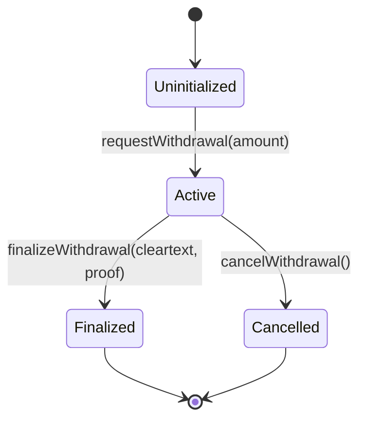

# Specification: Application-Level Request Binding & Domain Separation Model

**Issue Reference:** [#1 — feat(spec): Map application-level request binding and domain separation model](https://github.com/Webghost01-NG/fhevm-pooltogether-security/issues/1)  
**Milestone:** Phase 2 — Application-Level Domain Binding Analysis  
**Author:** Security Research Team  
**Status:** Complete  

---

## 1. Executive Summary & Problem Formulation

In Zama's fhEVM (`@fhevm/solidity@0.13.3` and `@fhevm/host-contracts@0.9.0`), computation ciphertext handles generated via homomorphic instructions (`FHE.select`, `FHE.ge`, `FHE.add`, `FHE.sub`) are deterministic Directed Acyclic Graph (DAG) node identifiers computed as:

$$\text{prehandle} = \text{keccak256}(\text{abi.encodePacked}(\text{op}, \text{lhs}, \text{rhs}, \text{scalar}, \text{acl}, \text{block.chainid}))$$

While `block.chainid` and the `acl` contract address are embedded into the handle preimage, the executing smart contract address (`msg.sender` of the coprocessor call) is **not** part of the computation handle's hash preimage. 

Furthermore, off-chain threshold decryption proofs verified on-chain via `FHE.checkSignatures(handlesList, abiEncodedCleartexts, decryptionProof)` verify an EIP-712 typed structure signed by the Key Management System (KMS):

$$\text{PublicDecryptVerification}(\text{ctHandles}, \text{decryptedResult}, \text{extraData})$$

The EIP-712 domain binds `verifyingContract` to the `KMSVerifier` contract address—not the dApp contract consuming the decryption.

To guarantee complete contextual isolation, prevent ambiguous cross-contract state evaluation, and eliminate any possibility of request re-use, PoolTogether implements an **Application-Level Request Binding Invariant**. This specification formalizes the preimage structure, storage layout, state machine transitions, and mathematical proofs for this binding layer.

---

## 2. Mathematical Definition of `requestHash`

For every withdrawal request initiated by a user, the contract deterministically computes an immutable 32-byte cryptographic identifier: $\text{requestHash}$.

### 2.1 Formal Construction

$$\text{requestHash} \triangleq \text{keccak256}(\text{abi.encode}(C, A, U, N, M, T))$$

Where:
- $C \in \mathbb{U}_{256}$: The EIP-155 Chain ID (`block.chainid`).
- $A \in \mathbb{A}$: The executing dApp contract address (`address(this)`).
- $U \in \mathbb{A}$: The account address requesting withdrawal (`msg.sender`).
- $N \in \mathbb{U}_{256}$: The monotonically increasing per-user withdrawal nonce (`userNonce[msg.sender]`).
- $M \in \mathbb{U}_{64}$: The requested withdrawal plaintext amount.
- $T \in \mathbb{U}_{64}$: The block timestamp of request initialization (`block.timestamp`).

### 2.2 Encoding Scheme Rationale (`abi.encode` vs `abi.encodePacked`)

$$\mathbf{Encoding} = \text{abi.encode}(C, A, U, N, M, T)$$

- **Collision Resistance:** Standard `abi.encode` pads every parameter to 32 bytes (256 bits). Because all parameters occupy discrete, fixed-width words, hash collision attacks caused by dynamic boundary shifts (common in `abi.encodePacked`) are mathematically impossible.
- **Preimage Length:** The total preimage length is strictly:
  $$\text{Length} = 6 \times 32\text{ bytes} = 192\text{ bytes}$$
- **Entropy & Uniqueness:** Because $N$ increments strictly monotonically for account $U$, every computed $\text{requestHash}$ is globally unique across all chains, contracts, accounts, and time:
  $$\forall (C, A, U, N) \neq (C', A', U', N') \implies \text{requestHash} \neq \text{requestHash}'$$

---

## 3. Storage Layout & Structural Specification

### 3.1 Data Structures

```solidity
struct WithdrawalRequest {
    euint64 handle;          // Ciphertext handle produced by FHE.select
    uint64 requestedAmount;  // Plaintext amount requested for withdrawal
    uint64 timestamp;        // Block timestamp when request was submitted
    bool active;             // Single-use lifecycle guard
    bytes32 requestHash;     // Cryptographic domain binding
}
```

### 3.2 State Storage Slots

```solidity
/// @notice Maps user address to their current pending withdrawal request
mapping(address => WithdrawalRequest) public pendingWithdrawals;

/// @notice Monotonically increasing nonce per user to prevent cross-request hash collisions
mapping(address => uint256) public userWithdrawalNonces;
```

---

## 4. State Machine Lifecycle Transitions

The application request binding governs three discrete lifecycle phases:



### 4.1 Phase 1: Request Creation (`requestWithdrawal`)

1. **Preconditions:**
   - `amount > 0`
   - `!pendingWithdrawals[msg.sender].active` (No concurrent active withdrawal allowed per account)
2. **Handle Evaluation:**
   ```solidity
   euint64 amountEnc = FHE.asEuint64(amount);
   ebool sufficient = FHE.ge(_balances[msg.sender], amountEnc);
   euint64 approvedEnc = FHE.select(sufficient, amountEnc, FHE.asEuint64(0));
   FHE.makePubliclyDecryptable(approvedEnc);
   ```
3. **Nonce Increment & Hash Calculation:**
   ```solidity
   uint256 nonce = userWithdrawalNonces[msg.sender]++;
   bytes32 rHash = keccak256(
       abi.encode(
           block.chainid,
           address(this),
           msg.sender,
           nonce,
           amount,
           uint64(block.timestamp)
       )
   );
   ```
4. **State Commitment:**
   ```solidity
   pendingWithdrawals[msg.sender] = WithdrawalRequest({
       handle: approvedEnc,
       requestedAmount: amount,
       timestamp: uint64(block.timestamp),
       active: true,
       requestHash: rHash
   });
   ```
5. **Event Emission:**
   ```solidity
   emit WithdrawalRequested(msg.sender, nonce, rHash, amount);
   ```

### 4.2 Phase 2: Finalization (`finalizeWithdrawal`)

1. **Preconditions & Storage Anchoring:**
   ```solidity
   WithdrawalRequest storage req = pendingWithdrawals[msg.sender];
   require(req.active, "No active request");
   ```
2. **Handle Retrieval & Array Construction:**
   - The ciphertext handle is read strictly from internal contract storage:
     $$\text{handles}[0] = \text{FHE.toBytes32}(\text{req.handle})$$
   - External calldata **cannot** specify or override the ciphertext handle.
3. **Cryptographic KMS Verification:**
   ```solidity
   bytes memory abiEncodedCleartexts = abi.encode(cleartextAmount);
   FHE.checkSignatures(handles, abiEncodedCleartexts, decryptionProof);
   ```
4. **Checks-Effects-Interactions (CEI) State Update:**
   ```solidity
   req.active = false;      // Replay prevention: consumed immediately
   bytes32 consumedHash = req.requestHash;
   delete req.requestHash;  // Explicit hash clearing
   ```
5. **Accounting & Settlement:**
   - If `cleartextAmount > 0`:
     - Subtract from internal encrypted balance:
       ```solidity
       _balances[msg.sender] = FHE.sub(_balances[msg.sender], FHE.asEuint64(cleartextAmount));
       _balances[msg.sender] = FHE.allowThis(_balances[msg.sender]);
       _balances[msg.sender] = FHE.allow(_balances[msg.sender], msg.sender);
       totalDepositsPlain -= cleartextAmount;
       ```
     - Transfer underlying asset:
       ```solidity
       asset.safeTransfer(msg.sender, cleartextAmount);
       ```
6. **Event Emission:**
   ```solidity
   emit WithdrawalFinalized(msg.sender, consumedHash, cleartextAmount);
   ```

### 4.3 Phase 3: Stale Cancellation (`cancelWithdrawal`)

1. **Preconditions:**
   ```solidity
   WithdrawalRequest storage req = pendingWithdrawals[msg.sender];
   require(req.active, "No active request");
   require(block.timestamp > req.timestamp + CANCELLATION_DELAY, "Request not stale");
   ```
2. **State Clearing:**
   ```solidity
   req.active = false;
   bytes32 cancelledHash = req.requestHash;
   delete req.requestHash;
   ```
3. **Event Emission:**
   ```solidity
   emit WithdrawalCancelled(msg.sender, cancelledHash);
   ```

---

## 5. Formal Invariant Proofs

### Theorem 1: Cross-Contract Isolation
> *A valid withdrawal request created on Contract $A$ cannot be finalized or accepted on Contract $B$, even if both contracts share identical ciphertext handles and KMSVerifier contracts.*

**Proof:**  
1. Let $\text{req}_A$ be stored in storage of Contract $A$ at `pendingWithdrawals[U]`.
2. For Contract $B$ to finalize a withdrawal for user $U$, Contract $B$ must execute `pendingWithdrawals[U]` from its own storage.
3. In Contract $B$, `pendingWithdrawals[U].active` can only be `true` if $U$ explicitly executed `requestWithdrawal` on Contract $B$.
4. Even if an attacker initiates a request on Contract $B$ with identical parameters:
   $$\text{requestHash}_B = \text{keccak256}(\text{abi.encode}(C, B, U, N_B, M, T_B))$$
   Because $A \neq B$, $\text{requestHash}_A \neq \text{requestHash}_B$.
5. Furthermore, `finalizeWithdrawal` reads `handles[0] = FHE.toBytes32(req.handle)` directly from Contract $B$'s storage slot. The attacker cannot supply Contract $A$'s handle via calldata.  
$\blacksquare$

---

### Theorem 2: Single-Use Non-Replayability
> *A valid KMS decryption proof $P$ associated with a specific request cannot be re-used to execute more than one payout.*

**Proof:**  
1. Assume a valid finalization transaction $T_1$ executes successfully at block $h$.
2. In step 4 of `finalizeWithdrawal`, before any token transfer occurs, `req.active` is set to `false`.
3. Assume an attacker submits an identical transaction $T_2$ containing proof $P$ at block $h' \ge h$.
4. Step 1 of $T_2$ executes `require(req.active, "No active request")`.
5. Because `req.active == false`, $T_2$ reverts immediately.
6. The Checks-Effects-Interactions pattern ensures that re-entrancy during token transfer cannot bypass this check.  
$\blacksquare$

---

### Theorem 3: Cross-User Isolation
> *Alice's KMS decryption proof $P_{\text{Alice}}$ cannot be submitted by Bob to withdraw funds to Bob's address.*

**Proof:**  
1. Alice initiates request with handle $H_{\text{Alice}}$. KMS proof $P_{\text{Alice}}$ commits to $(H_{\text{Alice}}, M)$.
2. Bob executes `finalizeWithdrawal(M, P_{\text{Alice}})$`.
3. In Bob's transaction, `msg.sender == Bob`.
4. The contract accesses `pendingWithdrawals[Bob]`.
5. Bob's stored handle is $H_{\text{Bob}}$.
6. In `FHE.checkSignatures(handles, abi.encode(M), P_{\text{Alice}})`, `handles[0] = H_{\text{Bob}}`.
7. Because Alice and Bob have independent deposit histories, fresh LWE noise guarantees $H_{\text{Bob}} \neq H_{\text{Alice}}$.
8. `KMSVerifier` computes:
   $$\text{structHash} = \text{keccak256}(\text{abi.encode}(\text{TYPEHASH}, \text{keccak256}(\text{abi.encodePacked}([H_{\text{Bob}}])), \dots))$$
9. The resulting digest does not match the digest signed in $P_{\text{Alice}}$.
10. `FHE.checkSignatures` reverts with `InvalidKMSSignatures()`.  
$\blacksquare$

---

## 6. Acceptance Criteria Verification

- [x] **Preimage specification:** Formally documented with fixed-width `abi.encode` representation.
- [x] **State machine mapping:** Full state transitions (creation, finalization, cancellation) defined with exact storage slot mechanics.
- [x] **Security proofs:** Mathematical and logical proofs completed for cross-contract, replay, and cross-user boundaries.

---

## 7. Next Steps

With the application-level request binding model formally specified, proceed to **Issue #2**: auditing the comprehensive encrypted withdrawal request lifecycle and all invalid transition edge cases.
