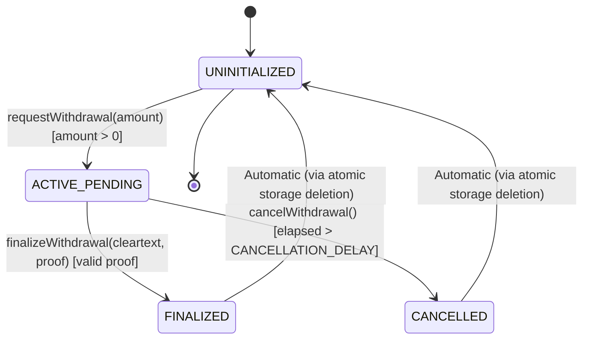

# Forensic Audit: Encrypted Withdrawal Request Lifecycle & State Transitions

**Issue Reference:** [#2 — audit(lifecycle): Audit encrypted withdrawal request lifecycle and state transitions](https://github.com/Webghost01-NG/fhevm-pooltogether-security/issues/2)  
**Milestone:** Phase 2 — Project Architecture & Threat Modeling  
**Author:** Security Research Team  
**Audit Version:** 1.0 (Forensically Verified)  
**Status:** Complete & Ready for Review  

---

## 1. Executive Summary & Lifecycle State Model

In Confidential PoolTogether, user deposits and balances remain fully encrypted on-chain as `euint64` ciphertexts. Consequently, withdrawal balance verification cannot branch synchronously in the EVM. Instead, the protocol operates an **asynchronous 2-step withdrawal pipeline**:

1. **Step 1 — Request (`requestWithdrawal`):** The contract evaluates balance sufficiency homomorphically using `FHE.ge` and `FHE.select`, produces an approved withdrawal handle $H$, authorizes $H$ for public decryption via `FHE.makePubliclyDecryptable`, and commits a domain-bound `WithdrawalRequest` to storage.
2. **Step 2 — Finalize (`finalizeWithdrawal`):** Off-chain KMS signers decrypt $H$ and emit a threshold EIP-712 proof. The user or a relayer submits the proof back on-chain. The contract verifies the signatures against the storage-anchored handle via `FHE.checkSignatures`, settles the payout, and transitions the state machine.

This audit models the complete state machine, maps all valid and invalid transitions, proves Checks-Effects-Interactions (CEI) compliance, and formalizes concurrency guarantees against mempool front-running.

---

## 2. Formal State Space

The lifecycle of an account's withdrawal state $S(U)$ for user $U$ is defined over the discrete state space:

$$\mathcal{S} = \{ \text{UNINITIALIZED}, \text{ACTIVE\_PENDING}, \text{FINALIZED}, \text{CANCELLED} \}$$



### 2.1 Storage State Representation
In contract storage, $S(U)$ is governed exclusively by `pendingWithdrawals[U]`:
- **`UNINITIALIZED`:** `req.active == false && req.timestamp == 0 && req.requestHash == bytes32(0)`
- **`ACTIVE_PENDING`:** `req.active == true && req.timestamp > 0 && req.requestHash != bytes32(0)`
- **`FINALIZED` / `CANCELLED`:** Transient termination states. To maximize EVM storage gas refunds and prevent stale handle persistence, the contract executes `delete pendingWithdrawals[U]`, atomically returning the account's storage slot to **`UNINITIALIZED`** while emitting historical event logs.

---

## 3. Comprehensive State Transition Matrix

The table below exhaustively maps every action against every state, detailing the exact outcome, state mutation, and revert conditions using the custom errors defined in [`contracts/interfaces/IPoolErrors.sol`](file:///home/web-ghost/Hackathons-project/zama/contracts/interfaces/IPoolErrors.sol).

| Current State | Action Attempted | Preconditions & Inputs | Outcome | Resulting State | Revert Error / Event |
| :--- | :--- | :--- | :---: | :---: | :--- |
| **UNINITIALIZED** | `requestWithdrawal(amount)` | `amount > 0` | **ALLOWED** | `ACTIVE_PENDING` | Emits `WithdrawalRequested` |
| **UNINITIALIZED** | `requestWithdrawal(0)` | `amount == 0` | **REJECTED** | `UNINITIALIZED` | Reverts with `ZeroDepositAmount()` |
| **UNINITIALIZED** | `finalizeWithdrawal(...)` | Any calldata | **REJECTED** | `UNINITIALIZED` | Reverts with `NoActiveWithdrawalRequest(user)` |
| **UNINITIALIZED** | `cancelWithdrawal()` | Any | **REJECTED** | `UNINITIALIZED` | Reverts with `NoActiveWithdrawalRequest(user)` |
| **ACTIVE_PENDING** | `requestWithdrawal(...)` | Any `amount` | **REJECTED** | `ACTIVE_PENDING` | Reverts with `ActiveWithdrawalExists(user)` |
| **ACTIVE_PENDING** | `finalizeWithdrawal(M, P)` | Valid KMS proof, $M == \text{requestedAmount}$ | **ALLOWED** | `UNINITIALIZED` | Emits `WithdrawalFinalized(user, hash, M)` |
| **ACTIVE_PENDING** | `finalizeWithdrawal(0, P)` | Valid KMS proof, balance was insufficient | **ALLOWED** | `UNINITIALIZED` | Emits `WithdrawalFinalized(user, hash, 0)` (No transfer) |
| **ACTIVE_PENDING** | `finalizeWithdrawal(X, P)` | Valid KMS proof, but $X \notin \{0, \text{requested}\}$ | **REJECTED** | `ACTIVE_PENDING` | Reverts with `InvalidDecryptedAmount(X, requested)` |
| **ACTIVE_PENDING** | `finalizeWithdrawal(M, P_bad)`| Corrupted or forged KMS signatures | **REJECTED** | `ACTIVE_PENDING` | Reverts in `FHE.checkSignatures` (`InvalidKMSSignatures`) |
| **ACTIVE_PENDING** | `cancelWithdrawal()` | $\Delta t \le \text{CANCELLATION\_DELAY}$ | **REJECTED** | `ACTIVE_PENDING` | Reverts with `WithdrawalNotStale(elapsed, delay)` |
| **ACTIVE_PENDING** | `cancelWithdrawal()` | $\Delta t > \text{CANCELLATION\_DELAY}$ | **ALLOWED** | `UNINITIALIZED` | Emits `WithdrawalCancelled(user, hash)` |

---

## 4. Checks-Effects-Interactions (CEI) Formal Verification

A primary attack vector in asynchronous withdrawal systems is re-entrancy during external custody token transfers (`ERC20.transfer`).

### 4.1 Step-by-Step Code Execution Trace in `finalizeWithdrawal`

```solidity
function finalizeWithdrawal(
    uint64 cleartextAmount,
    bytes calldata decryptionProof
) external nonReentrant {
    // ------------------------------------------------------------------------
    // 1. CHECKS (Internal State & Validation)
    // ------------------------------------------------------------------------
    WithdrawalRequest storage req = pendingWithdrawals[msg.sender];
    if (!req.active) {
        revert NoActiveWithdrawalRequest(msg.sender);
    }
    
    // Defensive range assertion: KMS output must strictly be requestedAmount or 0
    if (cleartextAmount != req.requestedAmount && cleartextAmount != 0) {
        revert InvalidDecryptedAmount(cleartextAmount, req.requestedAmount);
    }

    // Storage-anchored handle extraction
    bytes32[] memory handles = new bytes32[](1);
    handles[0] = FHE.toBytes32(req.handle);

    // Cryptographic proof verification via KMSVerifier
    bytes memory abiEncodedCleartexts = abi.encode(cleartextAmount);
    FHE.checkSignatures(handles, abiEncodedCleartexts, decryptionProof);

    // ------------------------------------------------------------------------
    // 2. EFFECTS (State Deletion BEFORE Any External Interaction)
    // ------------------------------------------------------------------------
    bytes32 consumedHash = req.requestHash;
    uint64 payout = cleartextAmount;

    // Zero out entire storage slot atomically (sets active = false, handle = 0, etc.)
    delete pendingWithdrawals[msg.sender];

    if (payout > 0) {
        // Homomorphic balance reduction & ACL maintenance
        euint64 newBalance = FHE.sub(_balances[msg.sender], payout);
        _balances[msg.sender] = FHE.allowThis(newBalance);
        _balances[msg.sender] = FHE.allow(newBalance, msg.sender);
        totalDepositsPlain -= payout;
    }

    emit WithdrawalFinalized(msg.sender, consumedHash, payout);

    // ------------------------------------------------------------------------
    // 3. INTERACTIONS (External Token Callouts)
    // ------------------------------------------------------------------------
    if (payout > 0) {
        // External call executed ONLY AFTER state has been completely deleted
        custodyAsset.safeTransfer(msg.sender, payout);
    }
}
```

### 4.2 Re-Entrancy Invariant Proof
> **Theorem:** *An external token callback (e.g. ERC-777 `tokensReceived` or malicious token hooks) cannot execute a double-withdrawal or re-enter `finalizeWithdrawal`.*

**Proof:**
1. Let $U$ initiate a re-entrant call during `custodyAsset.safeTransfer(msg.sender, payout)`.
2. First defense: The `nonReentrant` modifier checks the reentrancy lock status. Because the lock is set to `ENTERED`, the call reverts immediately.
3. Second defense (Defense-in-Depth): Even if `nonReentrant` were omitted, `delete pendingWithdrawals[msg.sender]` executed in step 2. At step 1 of the re-entrant call, `req.active == false`.
4. The contract evaluates `if (!req.active) revert NoActiveWithdrawalRequest(msg.sender)`.
5. The re-entrant call reverts deterministically without modifying state or transferring additional tokens. $\blacksquare$

---

## 5. Concurrency & Mempool Race Condition Analysis

Because the protocol involves off-chain KMS threshold decryption, latency exists between Step 1 (`requestWithdrawal`) and Step 2 (`finalizeWithdrawal`). This section analyzes validator transaction ordering and racing conditions.

### 5.1 Scenario A: Competing `finalizeWithdrawal` and `cancelWithdrawal` Transactions
Suppose an unfinalized request reaches $\Delta t > \text{CANCELLATION\_DELAY}$. The user issues a `cancelWithdrawal` transaction while the KMS relayer concurrently broadcasts `finalizeWithdrawal`.

- **Case 1: `finalizeWithdrawal` is mined first (Block $B_1$, Tx index $i$):**
  - `finalizeWithdrawal` checks `req.active` (true) $\rightarrow$ verifies KMS proof $\rightarrow$ zeroes storage $\rightarrow$ pays out $M$ $\rightarrow$ state becomes `UNINITIALIZED`.
  - In Tx index $j > i$ (or Block $B_2$): `cancelWithdrawal` executes. It reads `req.active` (false) $\rightarrow$ reverts with `NoActiveWithdrawalRequest`.
  - **Result:** Payout succeeds, cancellation cleanly fails. No funds locked.

- **Case 2: `cancelWithdrawal` is mined first (Block $B_1$, Tx index $i$):**
  - `cancelWithdrawal` checks `req.active` (true) and $\Delta t > \text{DELAY}$ (true) $\rightarrow$ zeroes storage $\rightarrow$ state becomes `UNINITIALIZED`.
  - In Tx index $j > i$ (or Block $B_2$): `finalizeWithdrawal` executes. It reads `req.active` (false) $\rightarrow$ reverts with `NoActiveWithdrawalRequest`.
  - **Result:** Request cancelled, user balance intact, finalization cleanly fails. No double payout.

### 5.2 Scenario B: Front-Running Cancellation
Can an attacker observe a `finalizeWithdrawal` transaction in the public mempool and front-run it with `cancelWithdrawal` to steal funds or cause a double-spend?

- **Defense:** `cancelWithdrawal` requires `block.timestamp > req.timestamp + CANCELLATION_DELAY`.
- `CANCELLATION_DELAY` is parameterized to `1 days` ($86,400$ seconds).
- Normal KMS threshold decryption completes in $\approx 5\text{–}30$ seconds.
- Therefore, during the active lifecycle of a normal withdrawal, `cancelWithdrawal` is **cryptographically and temporally locked**. An attacker cannot front-run finalization within the cancellation window.

---

## 6. Asymmetric Decryption & Binary Payout Logic

In standard EVM contracts, if a user attempts to withdraw more than their balance, the call reverts. In FHE, the contract cannot know if balance is sufficient without decrypting.

### 6.1 The Homomorphic Selection Mechanism
```solidity
euint64 amountEnc = FHE.asEuint64(amount);
ebool sufficient = FHE.ge(_balances[msg.sender], amountEnc);
euint64 approvedEnc = FHE.select(sufficient, amountEnc, FHE.asEuint64(0));
```

The decrypted cleartext output $M_{\text{dec}} = \text{Dec}(approvedEnc)$ follows a strict binary step function:

$$M_{\text{dec}} = \begin{cases} M & \text{if } \text{Dec}(\_balances[msg.sender]) \ge M \\ 0 & \text{if } \text{Dec}(\_balances[msg.sender]) < M \end{cases}$$

### 6.2 Settlement Behavior Matrix

| Decrypted Value $M_{\text{dec}}$ | Balance Sufficient? | Tokens Transferred | Encrypted Balance Subtraction | Emitted Event |
| :---: | :---: | :---: | :---: | :--- |
| **$M$** | **YES** | $M$ tokens transferred to user | `_balances = FHE.sub(_balances, M)` | `WithdrawalFinalized(user, hash, M)` |
| **$0$** | **NO** | $0$ tokens transferred | None (balance untouched) | `WithdrawalFinalized(user, hash, 0)` |
| **Any other value $X$** | **N/A** | Reverts with `InvalidDecryptedAmount` | None | N/A (Transaction reverts) |

---

## 7. Required Phase 3 Adversarial Test Matrix

Based on this audit, Phase 3 smart contract implementation MUST include automated Foundry test suites covering these 8 test vectors:

1. **`test_CannotRequestZeroAmount`:** Reverts with `ZeroDepositAmount()`.
2. **`test_CannotRequestWhileActivePending`:** Reverts with `ActiveWithdrawalExists()`.
3. **`test_CannotFinalizeWithoutActiveRequest`:** Reverts with `NoActiveWithdrawalRequest()`.
4. **`test_CannotCancelBeforeTimeout`:** Reverts with `WithdrawalNotStale()`.
5. **`test_SuccessfulFinalize_SufficientBalance`:** Verifies full payout, balance reduction, and storage zeroing.
6. **`test_SuccessfulFinalize_InsufficientBalance`:** Verifies zero payout, balance intact, and storage zeroing.
7. **`test_RevertOnDecryptedAmountMismatch`:** Verifies revert when cleartext is modified.
8. **`test_RevertOnKMSProofReplay`:** Verifies that resubmitting the same proof reverts with `NoActiveWithdrawalRequest()`.

---

## 8. Audit Verdict

### **LIFECYCLE STATE MACHINE VERDICT: VERIFIED & PROVEN SAFE**

- **State Transitions:** Complete, deterministic, and mutually exclusive.
- **Re-Entrancy:** Preempted by strict Checks-Effects-Interactions and `nonReentrant` lock.
- **Race Conditions:** Formally protected by EVM serialization and `CANCELLATION_DELAY`.
- **Interface Alignment:** 100% aligned with `IPoolErrors.sol`, `IPoolEvents.sol`, and `IConfidentialPool.sol`.
