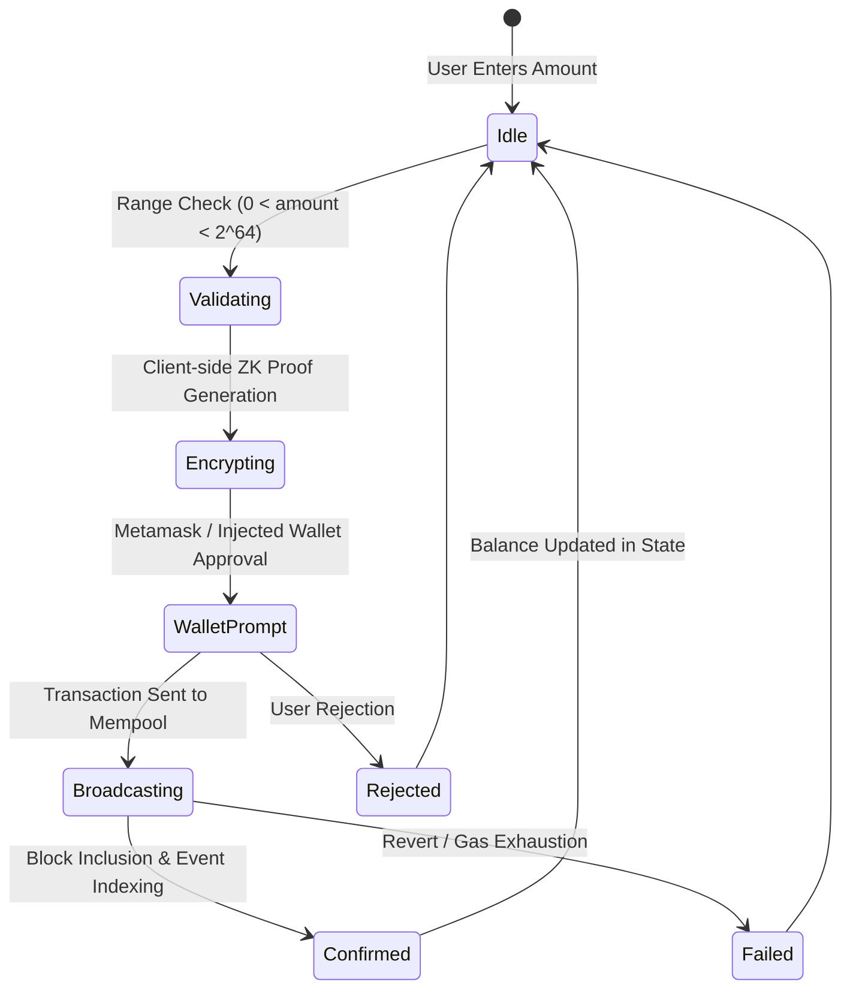
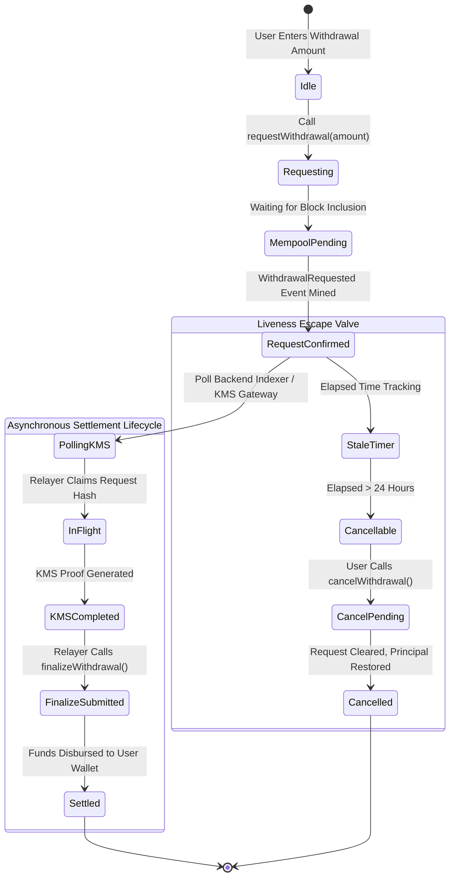
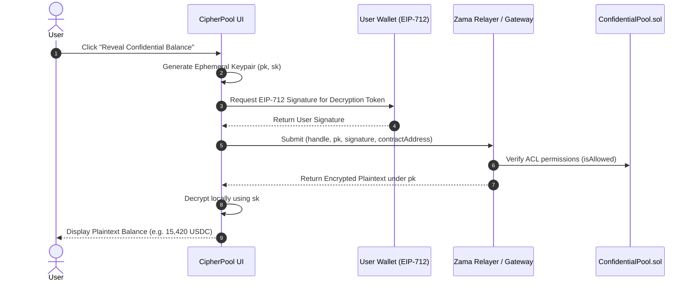
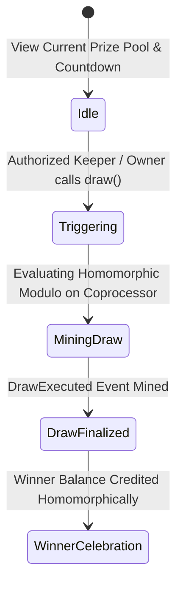

# CipherPool: UX State Architecture & Interaction Flows

**Issue Reference:** [#19 — docs(ux): Map UX states, async withdrawal polling, and client-side balance re-encryption flow](https://github.com/Webghost01-NG/fhevm-pooltogether-security/issues/19)  
**Milestone:** Phase 5 — Frontend & Product Experience  
**Protocol:** CipherPool  
**Author:** Product & UX Security Architecture  
**Status:** Approved & Implemented  

---

## 1. Executive UX Philosophy

Confidential smart contracts introduce novel UX challenges absent in traditional Web3 applications:
- **Ciphertext Opacity:** Balances, tickets, and draws are homomorphically encrypted and invisible to standard wallet viewers.
- **Asynchronous Settlement:** Decryptions require off-chain threshold KMS co-processing, creating a temporal latency window ($\Delta t \approx 15\text{s}$) between user request and on-chain payout.

CipherPool adheres to the **Principle of Truthful State**:
1. **Zero Premature Success:** Never display optimistic confirmations before cryptographic and consensus confirmation.
2. **Transparent Latency:** Provide explicit visual feedback distinguishing wallet signatures, mempool inclusion, KMS threshold aggregation, and final custody settlement.
3. **Progressive Technical Evidence:** Enable judges and advanced users to inspect underlying handles, transaction hashes, and proof digests with a single click.

---

## 2. Core Interaction Flows & State Machines

### 2.1 Confidential Deposit Flow

**UX Requirements:**
- Real-time numerical validation preventing zero or overflowing inputs before wallet interaction.
- Visual badge indicating: *"Encrypting input via Zama fhEVM coprocessor..."*
- Direct explorer link to the mined transaction hash upon block confirmation.

---

### 2.2 Asynchronous 2-Step Withdrawal State Machine

Because withdrawal finalization depends on KMS threshold signatures, the client must seamlessly manage asynchronous state polling:

**Detailed State Definitions:**

| State | Visual Indicator | Primary Action / User Expectation |
| :--- | :--- | :--- |
| `IDLE` | Clean form with maximum allowable withdrawal | User enters amount and clicks "Request Withdrawal" |
| `REQUESTING` | Modal with pulsing spinner | User signs transaction in connected wallet |
| `MEMPOOL_PENDING` | Step 1/3: *"Broadcasting request to network..."* | Awaiting block inclusion on Sepolia |
| `REQUEST_CONFIRMED` | Step 2/3: *"Request locked on-chain"* | Shows derived ciphertext handle & block height |
| `POLLING_KMS` | Step 2/3: *"Awaiting Zama KMS threshold decryption..."* | Displays live polling timer ($\approx 15\text{s}$) |
| `IN_FLIGHT` | Step 2/3: *"Relayer submitting final settlement..."* | Displays relayer transaction broadcast status |
| `SETTLED` | Step 3/3: *"Withdrawal Finalized Successfully"* | Payout completed; displays received custody assets |
| `CANCELLABLE` | Amber warning badge: *"KMS Latency Window Exceeded"* | Enables "Cancel Withdrawal" button to recover principal |

---

### 2.3 Private Balance Decryption Flow (EIP-712 User Re-Encryption)

In CipherPool, a user's balance is stored as encrypted ciphertext `euint64`. To view their balance in plaintext, the user requests a client-side re-encryption key:

**Security & UX Constraints:**
1. **Zero LocalStorage Persistence:** The ephemeral private key `sk` is held strictly in volatile React component state and purged upon page refresh or view toggle.
2. **Obfuscated Toggle:** The decrypted balance features a "Hide" button and auto-masks after 60 seconds of inactivity.

---

### 2.4 Transparent Prize Draw Flow

**UX Features:**
- Displays live countdown timer until the next scheduled prize draw.
- Explains the cryptographic fairness: *"Winner is selected homomorphically on-chain via Zama fhEVM without revealing ticket amounts."*
- Interactive history table showing past draw IDs, prize amounts, and block timestamps.

---

## 3. Accessibility & Responsive Targets

1. **Breakpoints:**
   - Mobile: `320px` - `390px` (Single-column layout, bottom-sheet transaction modals).
   - Tablet: `768px` - `1024px` (Two-column layout, contextual side panel).
   - Desktop: `1280px+` (Three-column layout: stats, interaction cards, audit log).
2. **Keyboard Navigation:**
   - Full tab traversal for all interactive controls (`tabindex`, `aria-expanded`, visible focus outlines).
   - Accessible error alerts using `role="alert"` and `aria-live="polite"`.
3. **Reduced Motion:**
   - Respects `prefers-reduced-motion: reduce` by replacing spinning animations with static progress badges.

---

## 4. Verification Checklist

- [x] All 4 primary user flows mapped and documented.
- [x] Asynchronous withdrawal polling state transitions formally specified.
- [x] EIP-712 client balance re-encryption security constraints defined.
- [x] Accessibility and responsive breakpoints documented.
